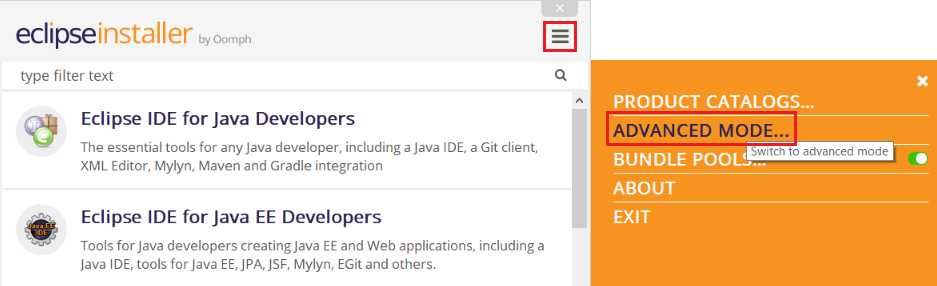
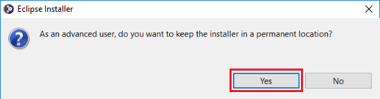

# How to contribute ?

## Set up an Eclipse workspace with teecube projects

### Download and install Eclipse Installer

The Eclipse Installer (aka Eclipse Oomph Installer) can be downloaded from 
https://wiki.eclipse.org/Eclipse_Installer

After launching the download file, switch to Advanced Mode:



Switching to Advanced Mode will prompt you whether to keep the installer in 
a permanent location:



Select yes. The default location is $HOME/eclipse-installer
(%UserProfile%/eclipse-installer for Windows).

At last, navigate to this permanent location and edit file _eclipse-inst.ini_ by
adding this line at the end:
```
-Doomph.redirection.setups=http://git.eclipse.org/c/oomph/org.eclipse.oomph.git/plain/setups/->https://git.teecu.be/teecube/t3-setup/raw/master/
```

## Generate the documentation locally

### Install a local Sonatype Nexus repository

Considering Docker is installed on the local machine and a Docker machine called
*default* exists and is reachable, simply install a local Sonatype Nexus
repository by executing this script :

```sh
sh -c "$(curl -fsSL https://git.teecu.be/teecube/helpers/raw/master/local-nexus/createLocalNexus.sh)"
```

### Deploy documentation

Using Maven