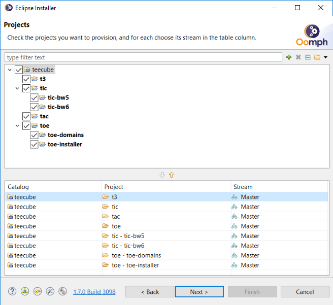
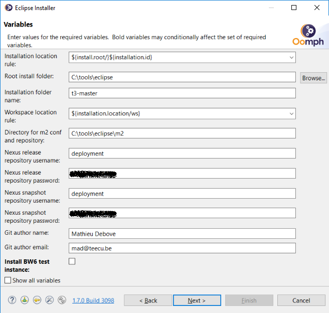

# How to contribute ?

## Set up an Eclipse workspace with teecube projects

### Download and install Eclipse Installer

The Eclipse Installer (aka Eclipse Oomph Installer) can be downloaded from 
https://wiki.eclipse.org/Eclipse_Installer.

After launching the downloaded file, switch to Advanced Mode:


Switching to Advanced Mode will prompt you whether to keep the installer in 
a permanent location:


Select yes. The default location is *$HOME/eclipse-installer*
(*%UserProfile%/eclipse-installer* for Windows).

At last, navigate to this permanent location and edit file _eclipse-inst.ini_ by
adding this line at the end:
```
-Doomph.redirection.setups=http://git.eclipse.org/c/oomph/org.eclipse.oomph.git/plain/setups/->https://git.teecu.be/teecube/t3-setup/raw/master/
```

Relaunch the Eclipse Installer.

### Set up a ready-to-use Eclipse environment

On the first screen of the Eclipse Installer, an Eclipse version can be chosen.
Default one to use is *Eclipse IDE for Java Developers*.

On the second screen, the *teecube* projects can be selected:



Configuration for the workspace is set on next screen:



Follow instruction to complete the setup (Next, Finish) and accept all licenses
and unsigned content when asked.

After some minutes, Eclipse workspace is ready.

### Use predefined *Run configurations*

## Generate the documentation locally

### Install a local Sonatype Nexus repository

Considering Docker is installed on the local machine and a Docker machine called
*default* exists and is reachable, simply install a local Sonatype Nexus
repository by executing this script :

```sh
sh -c "$(curl -fsSL https://git.teecu.be/teecube/helpers/raw/master/local-nexus/createLocalNexus.sh)"
```

### Deploy documentation

Using Maven